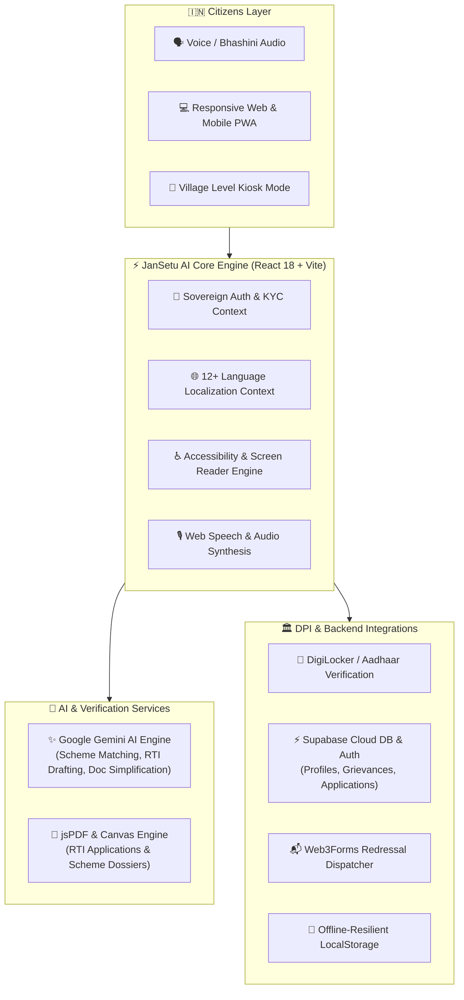

# 🇮🇳 JanSetu AI — India's Next-Gen AI Citizen Governance & DPI Bridge

<div align="center">

[](https://react.dev/)
[](https://www.typescriptlang.org/)
[](https://vitejs.dev/)
[](https://tailwindcss.com/)
[](https://supabase.com/)
[](https://ai.google.dev/)
[](LICENSE)

**Democratizing Public Services, Welfare Schemes, RTI Filing, Grievance Redressal, and DigiLocker Access through Conversational Multi-Lingual AI for 1.4+ Billion Indian Citizens.**

[Explore Features](#-key-features) • [DPI Architecture](#-digital-public-infrastructure-dpi-architecture) • [Getting Started](#-quick-start) • [Database Schema](#-database-schema) • [Contributing](#-contributing)

</div>

---

## 🌟 Executive Summary

**JanSetu AI** (जन सेतु - *Bridge for the People*) is a sovereign, AI-powered Digital Public Infrastructure (DPI) platform designed to eliminate bureaucracy, language barriers, and information asymmetry for Indian citizens interacting with government welfare systems.

By bridging cutting-edge **Google Gemini AI Models**, **DigiLocker KYC**, **Bhashini Multi-Lingual Voice Support**, **Web3Forms Dispatch**, and **Supabase Cloud DB**, JanSetu AI empowers every citizen—regardless of literacy level or spoken dialect—to discover schemes they qualify for, auto-generate legally precise RTI requests, draft and track actionable public grievances, and securely store sovereign documents.

---

## 🚀 Key Features

### 1. 🎯 AI-Powered Welfare Scheme Navigator
- **Semantic Eligibility Matching**: Automatically correlates citizen profile attributes (caste, income, landholding, gender, state, occupation) against hundreds of Central & State government schemes (PM-Kisan, Ayushman Bharat, PM Awas Yojana, PMMVY, etc.).
- **Interactive Multi-Step Application Wizard**: Guided application submission with real-time field validation, DigiLocker auto-fill, and application PDF generation.
- **Match Confidence Score**: Transparent eligibility percentages explaining *why* a citizen qualifies and what documents are required.

### 2. 📜 Automated Right to Information (RTI) Assistant
- **Legal Draft Generator**: Generates formal, compliant RTI drafts pursuant to Section 6(1) of the RTI Act, 2005.
- **Competent Authority & PIO Routing**: Identifies the correct Central/State Public Information Officer (PIO) and department address.
- **Court-Admissible PDF Export**: Instant client-side generation of styled, print-ready RTI application forms with fee declaration and acknowledgement slips.

### 3. 📢 Smart Public Grievance Redressal Engine
- **AI Tone Optimizer & Classification**: Converts emotional/distressed citizen complaints into structured, factual, and actionable legal grievances.
- **Department Routing**: Automatically identifies the relevant municipal, district, state, or central ministry (CPGRAMS, State Portals).
- **Direct Dispatch & Web3Forms Integration**: Sends automated email notices to departmental authorities with unique tracking numbers and status audit logs.

### 4. 🗄️ Sovereign Document Vault & AI Simplifier
- **DigiLocker Integration**: Verified syncing for Aadhaar, PAN Card, Ration Card, Kisan Credit Card, Income Certificate, and Land Records.
- **AI Legal Simplifier**: Upload complex government gazettes, notifications, or rejection letters, and receive simplified summaries in plain, conversational language.
- **Secure Client-Side Encryption**: Offline-resilient local caching combined with Supabase encrypted cloud storage.

### 5. 🗣️ Multi-Lingual & Voice-First Accessibility (Bhashini Inspired)
- **12+ Indian Regional Languages**: Hindi, English, Bengali, Telugu, Marathi, Tamil, Gujarati, Urdu, Kannada, Odia, Malayalam, and Punjabi.
- **Speech-to-Text & Text-to-Speech**: Full voice command navigation and audio readouts for illiterate or visually impaired citizens.
- **Accessibility Modes**: High contrast mode, dyslexia-friendly typography scaling, and keyboard-first navigation.

---

## 🏗️ Digital Public Infrastructure (DPI) Architecture



---

## 💻 Tech Stack & Dependencies

| Category | Technologies |
|---|---|
| **Frontend Framework** | [React 18.3](https://react.dev/) + [TypeScript 5.7](https://www.typescriptlang.org/) + [Vite 6.1](https://vitejs.dev/) |
| **Styling & Design** | [TailwindCSS 3.4](https://tailwindcss.com/) + Glassmorphic Bento Grid + [Lucide Icons](https://lucide.dev/) |
| **Motion & Animations** | [Framer Motion 12](https://www.framer.com/motion/) + [Canvas Confetti](https://www.npmjs.com/package/canvas-confetti) |
| **AI / LLM Integration** | [Google Generative AI SDK](https://www.npmjs.com/package/@google/generative-ai) (`gemini-2.0-flash`, `gemini-1.5-flash`) |
| **Cloud Backend & DB** | [Supabase Database & Auth](https://supabase.com/) (`@supabase/supabase-js`) |
| **Document Generation** | [jsPDF 2.5](https://github.com/parallax/jsPDF) (RTI & Scheme PDF Generation) |
| **Grievance Dispatch** | Web3Forms RESTful API + Mail Dispatcher |
| **Voice & Speech** | Web Speech Recognition & SpeechSynthesis (Bhashini-compatible) |

---

## 📂 Project Directory Structure

```
jansetu/
├── .env.example                     # Environment template for API credentials
├── .gitignore                       # Git ignore configuration
├── index.html                       # Application HTML5 entrypoint
├── package.json                     # NPM project dependencies and scripts
├── postcss.config.js                # PostCSS configuration
├── tailwind.config.js               # Tailwind design tokens and theme configuration
├── tsconfig.json                    # TypeScript compiler options
├── vite.config.ts                   # Vite build and plugin configuration
├── supabase/
│   └── schema.sql                   # SQL Schema for Supabase tables & RLS policies
├── stitch_jansetu_ai_governance_portal/ # Design system, mockups & UI token archive
└── src/
    ├── main.tsx                     # React root mount
    ├── App.tsx                      # Main application layout, routing & providers
    ├── index.css                    # Tailwind directives & glassmorphic styles
    ├── vite-env.d.ts                # TypeScript Vite environment definitions
    ├── types/
    │   └── index.ts                 # Core TypeScript interfaces & schemas
    ├── context/
    │   ├── AccessibilityContext.tsx # High contrast, font scaling, audio cues
    │   ├── AuthContext.tsx          # Supabase auth, demo citizens & credentials
    │   ├── CitizenContext.tsx       # Active citizen profile, KYC state & metrics
    │   └── LanguageContext.tsx      # 12 Indian languages translation dictionaries
    ├── services/
    │   ├── dummyData.ts             # Default mock schemes, citizens & grievances
    │   ├── gemini.ts                # Google Gemini API client & intelligent prompts
    │   ├── speech.ts                # Speech-to-Text and Text-to-Speech service
    │   └── supabaseClient.ts        # Supabase client singleton & DB health check
    └── components/
        ├── auth/                    # Login, KYC verification & Supabase modal
        ├── bento/                   # Bento grid interactive widget cards
        ├── hero/                    # Universal search & quick action bar
        ├── layout/                  # Header, Sidebar, Profile & API Key modal
        ├── schemes/                 # Scheme application wizard & eligibility checks
        └── views/                   # Dashboard, Schemes, Grievance, RTI, Vault
```

---

## ⚡ Quick Start

### Prerequisites
- [Node.js](https://nodejs.org/) (version 18.0.0 or higher)
- [npm](https://www.npmjs.com/) (version 9.0.0 or higher)

### 1. Clone the Repository
```bash
git clone https://github.com/DevRudrax/JanSetu-AI.git
cd JanSetu-AI
```

### 2. Install Dependencies
```bash
npm install
```

### 3. Setup Environment Variables
Copy the `.env.example` to `.env`:
```bash
cp .env.example .env
```

Edit `.env` with your API credentials:
```env
# Google Gemini API Key (https://aistudio.google.com/)
VITE_GEMINI_API_KEY=your_gemini_api_key_here

# Web3Forms API Key for Grievance Dispatch (https://web3forms.com/)
VITE_WEB3FORMS_ACCESS_KEY=your_web3forms_access_key
VITE_TARGET_DISPATCH_EMAIL=your_email@domain.com

# Supabase Cloud Database (Optional for cloud sync, fallback works automatically)
VITE_SUPABASE_URL=https://your-project.supabase.co
VITE_SUPABASE_ANON_KEY=your_supabase_anon_key
```

### 4. Run Development Server
```bash
npm run dev
```
Open your browser and navigate to `http://localhost:5173`.

### 5. Build for Production
```bash
npm run build
npm run preview
```

---

## 🗄️ Database Schema (Supabase)

JanSetu AI includes a production-ready SQL migration located at `supabase/schema.sql`.

Key Tables:
- `profiles`: Citizen demographics, socioeconomic indicators, landholding, and KYC status.
- `applications`: Welfare scheme applications, auto-filled form data, and stage progress.
- `grievances`: Registered complaints, department routing, Web3Forms reference ID, and audit history.
- `rti_requests`: Legal RTI drafts, target public authorities, PIO details, and filing dates.
- `documents`: DigiLocker verified files, encrypted metadata, and OCR extraction records.

---

## 🤝 Contributing

Contributions to JanSetu AI are welcome! Help us make governance accessible to every Indian citizen.

1. Fork the Repository
2. Create your Feature Branch (`git checkout -b feature/amazing-feature`)
3. Commit your Changes (`git commit -m 'feat: add amazing feature'`)
4. Push to the Branch (`git push origin feature/amazing-feature`)
5. Open a Pull Request

---

## 📄 License

Distributed under the MIT License. See `LICENSE` for more information.

---

<div align="center">

**Built with ❤️ for a Digital, Empowered & Inclusive Bharat 🇮🇳**

Developed by [Rudra pratap Singh (DevRudrax)](https://github.com/DevRudrax)

</div>
